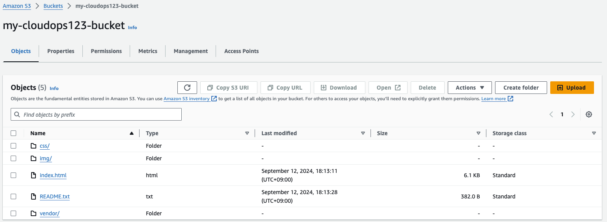
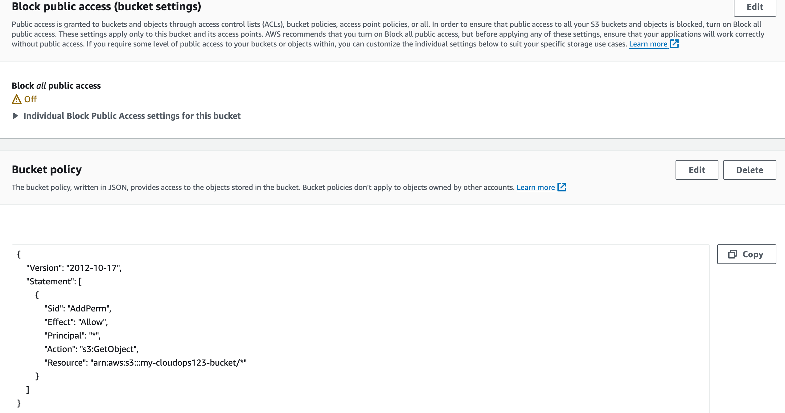
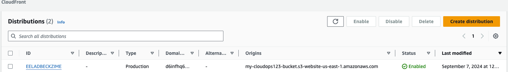

# Deploy Static Website on AWS

**Description**
In this project, you will deploy a static website to AWS using S3, CloudFront, and IAM.

The files included are:

index.html - The Index document for the website.

**Instructions**
1. Create S3 bucket
    bucket name: my-3428203-bucket-website
    uncheck: block all public access

2. Upload index.html to S3 bucket
3. Add policy to S3 bucket

4. The S3 bucket is configure to support website hosting

5. Create CloudFront distribution
   
Website URL: https://d6infhq6mxyzt.cloudfront.net

